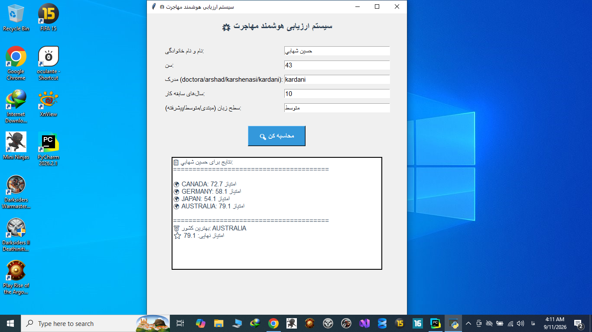

# 🌟 Smart Immigration Advisor

A Python-based application that helps users compare countries for immigration based on multiple factors.

---

## ✨ Features

- Compares 4 countries (Canada, Germany, Japan, Australia)
- Evaluates based on 6 factors:
  - Language difficulty
  - Culture fit
  - Weather
  - Security
  - Cost of living
  - Python job market
- Supports 5 education levels (Diploma, Associate, Bachelor, Master, PhD)
- Beautiful GUI built with Tkinter
- Automatic report generation and file storage

---

## 🛠️ Technologies Used

- **Python 3.x**
- **Tkinter** (GUI)
- **Git & GitHub**

---

## 🚀 How to Run

1. Clone the repository:

```bash
git clone https://github.com/hshpython/smart-immigration-advisor.git
```

2. Navigate to the project folder:

```bash
cd smart-immigration-advisor
```

3. Run the GUI application:

```bash
python gui_app.py
```

Or run the terminal version:

```bash
python main.py
```

---

## 📊 How It Works

The application calculates an immigration score for each country based on:

| Factor | Weight | Description |
|--------|--------|-------------|
| Immigration Score | 10% | Based on age, education, experience |
| Language | 20% | Difficulty of learning the language |
| Job Market | 20% | Python job opportunities |
| Culture | 20% | Cultural compatibility |
| Cost of Living | 10% | Affordability |
| Security | 10% | Safety and stability |
| Weather | 10% | Climate compatibility |

The country with the highest final score is recommended.

---

## 📸 Screenshot



---

## 👤 Author

**Hossein Shahabi**
- GitHub: [@hshpython](https://github.com/hshpython)

---

## 📄 License

This project is open-source and available for learning purposes.
